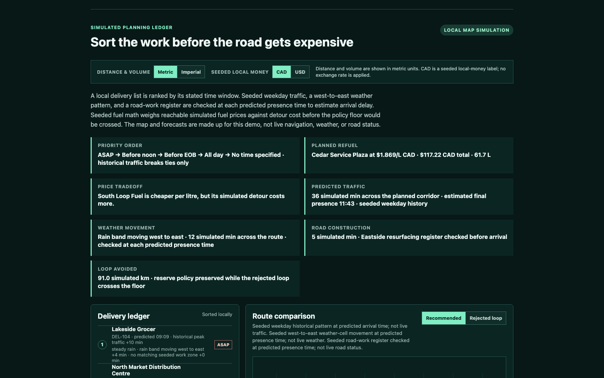

# PITT Build Week

PITT is a deliberately narrow demo of a trip-exception and report assistant for delivery drivers. It begins with a simulated delivery ledger that orders time windows, applies seeded traffic, moving weather, and road-work checks at predicted presence times, and inserts a reachable simulated fuel stop. It then plays a driver-controlled seeded day with two fuel-price events and four demonstrable decision outcomes before showing one refrigerated-delivery exception: a route delay makes a fuel stop urgent, the driver reviews a deterministic recommendation, and a report draft is produced for approval.

When a delivery day changes, drivers must reconcile time windows, fuel reserve, detours, and exception paperwork. Navigation can find a route; PITT explores the decision layer that explains whether changing it is worthwhile and records what happened. The specific design bet is that an inspectable, driver-controlled recommendation is more useful than hidden optimization or another autonomous instruction.



This repository is organized for several harnesses working in parallel without merging unverified ideas into the demo.

## Product Direction

The demo is the POC for a driver-first commercial direction, not a claim of a finished fleet platform. `CONTROL/PRODUCT_DIRECTION.md` separates the working local POC from potential driver-companion, fleet-workflow, and customer-operated deployment paths. It also records the validation questions that must be answered before any commercial claim is made.

For Build Week submission evidence and official links, see `SUBMISSION/DEVWEEK_REFERENCES.md`.

## Start Here

1. Read `CONTROL/WORKBOARD.md`.
2. Work only in a lane that is unclaimed or assigned to you.
3. Record evidence and resume notes in `HANDOFFS/<harness>.md`.
4. Run `python3 scripts/collate_handoffs.py` before asking the integrator to merge work.

The integration lane is deliberately small. A contribution is not ready merely because it builds: it must have a stated acceptance check and captured result.

## Run The Local Demo

This branch contains a dependency-free local demo shell under `app/`. It uses only seeded data and can be opened without credentials or a provider key.

```bash
npm test
npm run serve
```

Open `http://127.0.0.1:4173` and complete the visible path:

1. Inspect the simulated delivery ledger and compare the recommended corridor against the rejected loop.
2. Advance the seeded day; at noon and 3 PM, compare a fuel-price recalculation with keeping the current route.
3. Review the seeded trip and acknowledge the deterministic reserve-risk recommendation.
4. Review and confirm the locally generated report draft, including its leg-level delivery outcomes.

The existing scenario, UI, and AI/report lanes can replace the corresponding local modules later. The demo must remain usable when no model endpoint is configured.

## Demo Boundary

PITT does not control a vehicle, dispatch real routes, access regulated vehicle systems, or claim live traffic, weather, road-work, mapping, real station information, or fuel-pricing data. Its route diagram uses clearly labelled invented coordinates, local deterministic calculations, seeded fuel prices balanced against simulated detour cost, seeded weekday historical traffic, a moving weather cell, and a seeded work-zone register at predicted presence times. Model output is a reviewable draft, never an autonomous instruction.

The display can switch between metric and imperial physical units. It can also label the seeded local-money scenario as CAD or USD; this is not a currency-conversion feature and does not use an exchange-rate feed.

The report includes a compact Lua-table machine handoff for a later approved workflow. It remains local, shows `driver_review_required` until the driver confirms review, and never sends or triggers downstream automation on its own.

See `CONTROL/PRODUCT_SCOPE.md` for the exact demo contract and `CONTROL/WORKBOARD.md` for the current queue.

## How We Used Codex and GPT-5.6

Codex was central to the Build Week work: it established the collaboration lanes and contracts, implemented and integrated the deterministic demo modules, added regression tests, and maintained the evidence trail that ties claims to committed code and validation. GPT-5.6 informed the bounded product and report-design work, including the provider-neutral report contract and its requirement that deterministic facts remain authoritative.

The collaboration changed the product, not only the code. Browser testing exposed a missing economic branch: after a morning fill, a later cheap pump should still be rejected when its saving cannot recover the detour. Codex helped turn that observation into an explicit rule, UI explanation, unit coverage, and four end-to-end Playwright outcomes. The current evidence is 27 Node tests, 24 Python adapter tests, and four browser runs.

The runnable demo deliberately uses the deterministic local fallback so a reviewer can test it without credentials. An optional OpenAI-compatible report adapter is present for later approved use; it is not required for the POC to function and does not issue driver instructions.
